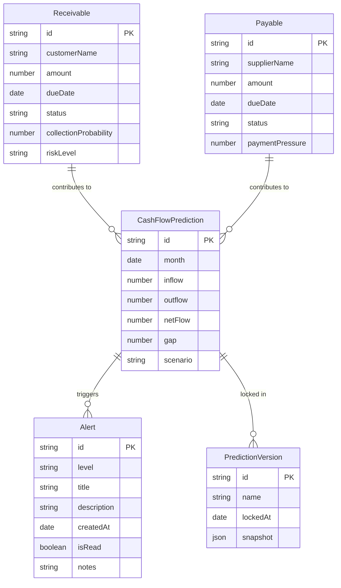

## 1. 架构设计

```mermaid
flowchart TD
    "前端 React App" --> "Zustand 状态管理"
    "Zustand 状态管理" --> "Mock 数据层"
    "Mock 数据层" --> "模拟 AI 预测引擎"
    "前端 React App" --> "Recharts 图表库"
    "前端 React App" --> "Lucide Icons"
    "前端 React App" --> "Tailwind CSS"
```

## 2. 技术说明

- 前端：React@18 + TypeScript + Tailwind CSS@3 + Vite
- 初始化工具：vite-init
- 后端：无（纯前端项目，使用 Mock 数据模拟 AI 预测）
- 状态管理：Zustand
- 图表库：Recharts
- 图标库：Lucide React
- 数据库：无（使用内存 Mock 数据）

## 3. 路由定义

| 路由 | 用途 |
|------|------|
| / | 首页 - 资金总览仪表盘 |
| /data-import | 数据接入 - 导入应收应付数据、识别异常 |
| /prediction | 预测 - 月度现金流预测、资金缺口、安全余额 |
| /customer-collection | 客户回款 - 按客户预测回款概率 |
| /supplier-payment | 供应商付款 - 按供应商预测付款压力 |
| /scenario | 情景推演 - 模拟延迟回款、提前采购 |
| /alert | 预警 - 风险等级、推送预警、备注、对比、导出 |

## 4. 数据模型

### 4.1 数据模型定义



### 4.2 核心类型定义

```typescript
interface Receivable {
  id: string;
  customerName: string;
  amount: number;
  dueDate: string;
  status: 'pending' | 'partial' | 'received' | 'overdue';
  collectionProbability: number;
  riskLevel: 'A' | 'B' | 'C' | 'D';
  isAnomaly: boolean;
  anomalyReason?: string;
}

interface Payable {
  id: string;
  supplierName: string;
  amount: number;
  dueDate: string;
  status: 'pending' | 'partial' | 'paid' | 'overdue';
  paymentPressure: number;
  priority: number;
}

interface CashFlowPrediction {
  id: string;
  month: string;
  inflow: number;
  outflow: number;
  netFlow: number;
  gap: number;
  scenario: 'optimistic' | 'neutral' | 'pessimistic';
}

interface Alert {
  id: string;
  level: 'green' | 'yellow' | 'orange' | 'red';
  title: string;
  description: string;
  createdAt: string;
  isRead: boolean;
  notes: string[];
  relatedEntityId?: string;
}

interface PredictionVersion {
  id: string;
  name: string;
  lockedAt: string;
  predictions: CashFlowPrediction[];
  actuals: CashFlowPrediction[];
}

interface SafetyBalance {
  amount: number;
  updatedAt: string;
}

interface ScenarioSimulation {
  id: string;
  name: string;
  collectionDelayDays: number;
  earlyPurchaseAmount: number;
  adjustedNetFlow: CashFlowPrediction[];
}
```
